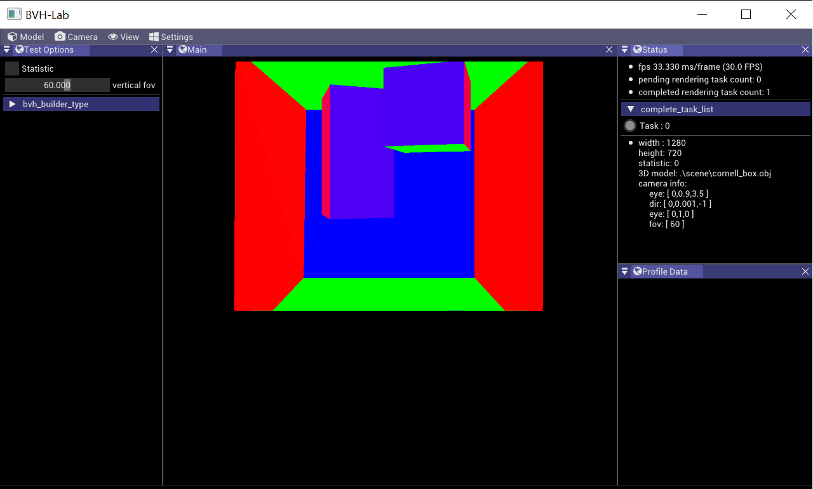

## Overview

- It is aimed to compare a Bounding Volume Hierarchy (BVH) algorithms including constructon algorithms and optimizaton alogrithms.
- The following is the screen shot.

## Featurs 
- [x] a single queue task scheduler. 
- [x] imgui based UI

## Credits 

- [imgui](https://github.com/ocornut/imgui)
- [optix_advanced_samples](https://github.com/nvpro-samples/optix_advanced_samples)
- [tinsel](https://github.com/mmacklin/tinsel)
- [Font-Awesome](https://raw.githubusercontent.com/FortAwesome/Font-Awesome/fa-4/src/icons.yml)
- [fontawesome-webfont](https://github.com/FortAwesome/Font-Awesome/blob/fa-4/fonts/fontawesome-webfont.ttf)
- [spdlog](https://github.com/gabime/spdlog)

